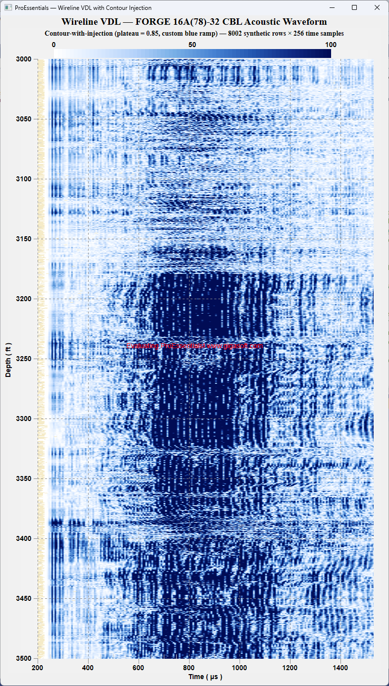

# ProEssentials WPF Wireline VDL — Variable Density Wave with Contour Injection

A ProEssentials v10 WPF .NET 8 demonstration of a wireline Variable Density
Wave (VDL) acoustic log using PesgoWpf — adapted from the HeatmapSpectrogram
sample with one key addition: a **contour-with-injection** technique that
renders large-scale VDL data without smearing artifacts at any zoom level.



---

## What This Demonstrates

Real public-domain wireline acoustic log data from the Utah FORGE
geothermal well **16A(78)-32**, rendered in the canonical wireline VDL
panel format:

- **4,001** source depth rows × **256** time samples = ~1 M data cells
  (~50 MB on disk, doubled to **8,002** rows after contour injection)
- **Time on X** (200–1500 µs, first arrival to late ringdown)
- **Depth on Y** (3000–3500 ft, geological depth-down convention)
- **Custom monochromatic blue ramp** — white at low amplitude (no signal,
  blends into cream background) → navy at high amplitude (strong arrival)
- **GPU-accelerated** ContourColors via Direct3D + ComputeShader pipeline
- **Live cursor readout** of exact (time, depth, amplitude) at any point

---

## The Smearing Problem & The Fix

The headline contribution of this sample is a rendering technique for
large VDL datasets, developed during a Gigasoft customer support thread
in May 2026. Published here as a reference implementation.

**Contour with raw depth rows** (Pesgo ContourColors, no preprocessing)
renders fast and at any scale. But contour interpolates smoothly between
sparse depth samples, producing diagonal smearing artifacts when the
depth interval per pixel is wider than the interpolation distance. At
wide zoom levels, distinct waveform arrivals blur into mushy streaks.

**Contour with depth-row injection** keeps contour's speed and scale
while eliminating the smearing. For each real depth `d[i]`, **two
synthetic rows** are inserted at near-midpoints to its neighbors, both
carrying identical Z values to `d[i]`. This creates a flat plateau
spanning ~85% of `d[i]`'s territory; contour interpolation is confined
to thin slivers between adjacent plateaus. The chart visually reads as
cell-discrete while remaining a smooth contour PE renders at full GPU
speed.

```csharp
For each original depth d[i]:
  halfBack    = midpoint to previous neighbor
  halfForward = midpoint to next neighbor
  territory   = halfForward - halfBack
  plateauHalf = territory × plateauRatio / 2

  Emit synthetic row at d[i] - plateauHalf  (start of plateau)
  Emit synthetic row at d[i] + plateauHalf  (end   of plateau)
  Both rows carry the same Z values as d[i]
```

The `INJECTION_PLATEAU_RATIO` constant near the top of
`MainWindow.xaml.cs` tunes the balance between plateau width and
interpolation gap. Default is **0.85** (85% plateau / 15% interpolation
sliver). Increase toward 0.99 for sharper cells, decrease toward 0.65
for smoother row-to-row fade.

**A future ProEssentials release will add a ComputeShader for pure
rectilinear heatmap plotting. Until then, the contour-injection
technique shown here is the recommended workaround — and some viewers
may actually prefer its softer, more realistic look over hard cell
boundaries.**

---

## ProEssentials Features Demonstrated

### ContourColors with Custom Blue Ramp

```csharp
Pesgo1.PePlot.Allow.ContourColors        = true;
Pesgo1.PePlot.Allow.ContourColorsShadows = true;
Pesgo1.PeColor.ContourColorBlends        = 10;

Pesgo1.PeColor.ContourColors.Clear();
Pesgo1.PeColor.ContourColors[0] = Color.FromRgb(255, 255, 255); // white   — low amp
Pesgo1.PeColor.ContourColors[1] = Color.FromRgb(220, 235, 255); // ice
Pesgo1.PeColor.ContourColors[2] = Color.FromRgb(180, 210, 250); // pale sky
Pesgo1.PeColor.ContourColors[3] = Color.FromRgb(120, 175, 230); // sky
Pesgo1.PeColor.ContourColors[4] = Color.FromRgb( 70, 130, 210); // medium
Pesgo1.PeColor.ContourColors[5] = Color.FromRgb( 35,  85, 175); // strong
Pesgo1.PeColor.ContourColors[6] = Color.FromRgb( 15,  40, 130); // dark
Pesgo1.PeColor.ContourColors[7] = Color.FromRgb(  0,  10,  80); // navy   — high amp

Pesgo1.PeColor.ContourColorSet = ContourColorSet.ContourColors; // user-defined mode
Pesgo1.PePlot.Method           = SGraphPlottingMethod.ContourColors;
```

8-stop monochromatic blue ramp matches real wireline VDL aesthetics.
Each amplitude cell renders as a single hue blue blob with luminance
encoding amplitude — no rainbow-target artifacts. Setting
`ContourColorBlends = 10` interpolates 10 sub-steps between each pair of
stops, yielding 70+ rendered colors across the gradient.

### Depth-Down Y Axis (Geological Convention)

```csharp
for (int d = 0; d < nDepths; d++)
    Pesgo1.PeData.Y[0, d] = -depths[d];           // negate Y data

Pesgo1.PeGrid.Option.InvertedYAxis = true;        // re-flip displayed labels
```

Wireline displays follow the geological convention: shallow at top, deep
at bottom. The data is fed with negated depth values, then
`InvertedYAxis = true` flips the displayed labels back to positive feet.
Net result: 3000 ft at top, 3500 ft at bottom, with positive labels
throughout.

### Cream Background — VDL Display Convention

```csharp
Pesgo1.PeColor.QuickStyle         = QuickStyle.LightNoBorder;
Pesgo1.PeColor.GraphGradientStyle = GradientStyle.Horizontal;
Pesgo1.PeColor.GraphGradientStart = Color.FromRgb(245, 235, 200);
Pesgo1.PeColor.GraphGradientEnd   = Color.FromRgb(245, 235, 200);
```

The white end of the blue ramp represents *no signal*. Against pure
white background, no-signal regions become invisible and the eye reads
only the dark high-amplitude features as orphan blobs. Against cream
(the standard wireline log paper color), no-signal regions fade gently
into the background while signal stands out crisply — exactly how a
printed VDL log reads.

### X-Axis Clipping (Pre-Arrival Skip)

```csharp
Pesgo1.PeGrid.Configure.ManualScaleControlX = ManualScaleControl.Min;
Pesgo1.PeGrid.Configure.ManualMinX          = 200;
```

The waveform is quiet from 0 to ~220 µs (pre-first-arrival). The data is
loaded full-range, but the view clips the X axis at 200 µs to skip the
all-zero column block — gives the actual arrivals the screen real estate
they deserve.

### Dimension-Discovering Data Loader

```csharp
// Pass 1: walk the file, collect unique depths and the first depth's time samples
// Pass 2: fill the [N × T] amplitude grid using the discovered dimensions
```

`LoadVdlTestData` discovers the data grid dimensions from the file
content rather than hardcoding them. Lets you regenerate the data file
at any depth-stride or time-stride from `convert_log_data.py` without
recompiling. The subtitle reflects the actual loaded dimensions at
runtime.

### ComputeShader + Direct3D

```csharp
Pesgo1.PeConfigure.Composite2D3D = Composite2D3D.Foreground;
Pesgo1.PeConfigure.RenderEngine  = RenderEngine.Direct3D;
Pesgo1.PeData.ComputeShader      = true;
```

`Composite2D3D.Foreground` renders the contour fill on the GPU, then
composites crisp 2D axes / grid / labels on top — best of both worlds.
`ComputeShader = true` delegates contour color interpolation to the GPU
shader pipeline. Handles the 1 M+ cell post-injection grid without
breaking a sweat; render time is well under 100 ms even at full
resolution.

### DuplicateData — Efficient Axis Storage

```csharp
Pesgo1.PeData.DuplicateDataX = DuplicateData.PointIncrement;
Pesgo1.PeData.DuplicateDataY = DuplicateData.SubsetIncrement;
```

Only one row of X (time) values and one column of Y (depth) values are
stored. The chart duplicates them internally for every subset/point —
avoids allocating and passing 2 M redundant axis values.

### XYZ Cursor Prompt

```csharp
Pesgo1.PeUserInterface.Cursor.PromptTracking = true;
Pesgo1.PeUserInterface.Cursor.PromptStyle    = CursorPromptStyle.XYZValues;
Pesgo1.PeUserInterface.Cursor.PromptLocation = CursorPromptLocation.Text;
```

Hover over any point to read the exact time (µs), depth (ft), and
amplitude — essential for analyst-style interaction with a log display.

---

## Data File

`TestData_FORGE_VDL.txt` — UTF-16 LE BOM, tab-separated, CRLF line
endings.

| Column | Content   | Range / Detail                                              |
|--------|-----------|-------------------------------------------------------------|
| 0      | Time (µs) | 0–1530, 256 samples at 6 µs increment                       |
| 1      | Depth (ft)| 3000–3500, 4001 samples at 0.125 ft increment               |
| 2      | Amplitude | 0–100, normalized to 99.5% percentile saturation            |

Ordering: **outer loop = depth, inner loop = time**. Empty time field
encodes time = 0 (start of waveform); empty amplitude field encodes
null.

**Source.** Utah FORGE Geothermal Data Repository, submission 1330,
McLennan 2021, DOI [10.15121/1814488](https://gdr.openei.org/submissions/1330)
(CC-BY 4.0 — attribution preserved below).

**Regenerating from source DLIS.** Requires Python with `dlisio` and
`numpy`. The conversion script `convert_log_data.py` lives in the
[`tools/`](tools/) folder of this project — see
[`tools/README.md`](tools/README.md) for full instructions, channel
listing, and adaptation to other wells.

```bash
python convert_log_data.py path/to/CBL.dlis VDL ^
    --depth-range 3000 3500 ^
    --depth-stride 1 ^
    --out TestData_FORGE_VDL.txt
```

Add `--depth-stride 4` to subsample to a smaller demo file (~12 MB
instead of 50 MB).

---

## Controls

| Input            | Action                                            |
|------------------|---------------------------------------------------|
| Hover            | Read exact time / depth / amplitude at cursor     |
| Left-click drag  | Zoom box                                          |
| Mouse wheel      | Horizontal + vertical zoom                        |
| Right-click      | Context menu (export, print, customize)           |

---

## Prerequisites

- Visual Studio 2022
- .NET 8 SDK
- Internet connection for NuGet restore

---

## How to Run

```
1. Clone this repository
2. Open WirelineVdl.sln in Visual Studio 2022
3. Build → Rebuild Solution (NuGet restore is automatic)
4. Press F5
```

---

## NuGet Package

References
[`ProEssentials.Chart.Net80.x64.Wpf`](https://www.nuget.org/packages/ProEssentials.Chart.Net80.x64.Wpf).
Package restore is automatic on build.

---

## Related Examples

- [Heatmap Spectrogram — same chart skeleton with logarithmic frequency Y axis](https://github.com/GigasoftInc/wpf-chart-spectrogram-heatmap-2d-contour-proessentials)
- [3D Delaunay Surface Heightmap — interpolated color surface from scattered XYZ data](https://github.com/GigasoftInc/wpf-chart-3d-delaunay-triangulation-surface-heightmap-proessentials)
- [Realtime 8M-Point Circular Buffer — ComputeShader streaming line chart](https://github.com/GigasoftInc/wpf-realtime-circular-buffer-8million-points-proessentials)
- [All Examples — GigasoftInc on GitHub](https://github.com/GigasoftInc)
- [Full Evaluation Download](https://gigasoft.com/net-chart-component-wpf-winforms-download)
- [gigasoft.com](https://gigasoft.com)

---

## Acknowledgements

The contour-with-injection technique demonstrated here was developed in
collaboration with Gigasoft technical support (May 2026) while building
VDL display functionality. Reproduced here as a reference implementation.

VDL data: **Utah FORGE Project**, well 16A(78)-32, Cement Bond Log
acquisition. Schlumberger contractor. Published via the U.S. Department
of Energy Geothermal Data Repository, McLennan 2021,
DOI [10.15121/1814488](https://gdr.openei.org/submissions/1330),
licensed under
[Creative Commons Attribution 4.0 International](https://creativecommons.org/licenses/by/4.0/).

---

## License

Example code in this repository is MIT licensed.

ProEssentials requires a commercial license for continued use beyond
evaluation; the sample includes evaluation watermark by default and a
free evaluation copy is available at
[gigasoft.com](https://gigasoft.com/net-chart-component-wpf-winforms-download).

The `TestData_FORGE_VDL.txt` data file is licensed CC-BY 4.0 from the
Utah FORGE project (DOI 10.15121/1814488, McLennan 2021). The
attribution above and in the conversion script's header satisfies the
attribution requirement.
